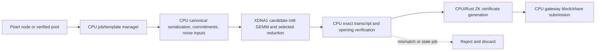

# Pearl (PRL) Research Architecture

## Implemented one-shot boundary

The physical implementation now follows the proposed boundary below. The
project-owned AIE2 kernel computes only the fixed `4x64x8` signed-int8 GEMM;
IRON DMA transforms provide the AIE2 lane layout, while the CPU pipeline
handles deterministic noise, correction, transcript, keyed BLAKE3, target,
openings, and PlainProof. `ComputePipeline` tiles the 2x64 selected proof
work over rank/common-dimension chunks and exact-compares every gathered
result. Gateway/node transport and supervisor/CLI code remain CPU-side. The
official useful-work tensor source and ZK/certificate runtime are explicit
external components, not silent synthetic substitutes.

## Boundary

Pearl is a separate research track. The existing Qubic runtime and its
verified M0–M5 XDNA infrastructure remain reference-only and are not retargeted
in P0. Generic XDNA capability detection, XRT buffer ownership, persistent
buffers, exact differential testing, and four-column artifact handling may be
reused only after a Pearl-specific contract is written and tested.



The arrows are a proposed responsibility boundary, not an implemented data
path. Network traffic and signing remain CPU-side. The NPU is a deterministic
compute backend with no authority to select an endpoint, create an identity,
or submit a result.

The full-project execution adds an operator CLI and supervisor around this
boundary, but does not move authority: CPU code owns work freshness, target
checks, proof reconstruction, submission policy, retries, logging, and clean
shutdown. The external official gateway/prover may own ZK proof generation and
certificate assembly where the component license remains unclear. No CPU
fallback is reported as XDNA execution.

### P7 official SIMNET interoperability path

P7 adds an explicit opt-in `--mine --official-simnet-e2e` path for the pinned
official local SIMNET only. It obtains the job through the official gateway's
`getMiningInfo`, creates a bounded dense A/B matrix pair, commits to the full
matrices, runs the selected noisy GEMM through the physical XDNA1 executor,
and performs the project CPU verification before submission. The adapter then
serializes the official bincode `PlainProof` object separately from the
project-owned P1 envelope and submits it through `submitPlainProof`.

The dense matrices are a deterministic SIMNET interoperability fixture, not a
claim that the official CUDA/vLLM useful-work provider was reproduced. The
official gateway/prover and node accepted the resulting physical-XDNA proof;
the acceptance evidence is in `docs/evidence/pearl-p7-e2e.json`. Raw source
signals are validated in `[-64,64]`; deterministic noising may produce any
signed-int8 value representable by the XDNA input contract, so the noised
operands are not incorrectly revalidated against the raw-source bound.

## Components

### CPU job and protocol manager

This component will eventually own:

- direct-node JSON-RPC `getblocktemplate` polling and template freshness;
- coinbase, transaction, Merkle root, incomplete header, target, and
  `requiredcertversion` handling;
- local gateway message framing (`getMiningInfo` and `submitPlainProof`);
- matrix dimensions, rank/configuration validation, nonce/job control, and
  stale-work cancellation;
- CPU reference inputs, commitment hashes, noise seeds, Merkle openings,
  certificate generation, and final verification.

The live/network responsibilities remain unimplemented. P1 implements only the
standalone CPU candidate oracle described below; it does not acquire jobs or
submit anything.

### Candidate CPU reference (P1 complete)

P1 must define a standalone trusted reference with explicit fixed-width fields:

```text
header/config bytes -> job_key
matrices A and B^T -> padded keyed BLAKE3 commitments
commitments/header -> noise seeds and exact int8 noise
selected noised tiles -> int32 products and full-r-chunk XOR
16-word transcript -> rotate-left(13) -> keyed BLAKE3 jackpot
jackpot/header/config -> target decision and PlainProof fields
```

The reference must preserve row-major matrix bytes, `B^T` orientation, little
endian integer serialization, signedness, pattern offsets, rank chunking, and
all exact seed labels. It is the oracle for every later XDNA result. P1 now
implements this boundary in `src/pearl/reference.cpp` with:

- explicit header, periodic-pattern, dense-config, public-data, and PlainProof
  serializers with truncation/trailing-byte rejection;
- fp32 symmetric quantization, checked int64-to-int32 scalar GEMM, noised
  products, denoising correction, deterministic BLAKE3-derived noise, and
  selected 2x64 transcript tracing;
- a clean-room 1024-byte Merkle tree/opening verifier and fixed-width
  pre-prover PlainProof model; and
- a canonical corpus plus seeded negative/randomized tests under
  `tests/data/pearl/p1/` and `tests/pearl_cpu_tests.cpp`.

The Rust helper under `src/pearl/blake3_ffi/` uses the official BLAKE3 hazmat
API only for standard keyed hashing and chunk/parent CV operations. No local
Pearl BLAKE3 source was used. This is a dependency boundary, not a claim that
the Pearl `pearl-blake3` component is reusable.

### Candidate XDNA1 backend

The first XDNA kernel should be the smallest independently testable primitive:

- input: a validated batch of signed int8 A/B/noise operands, dimensions,
  rank/chunk descriptors, and explicit strides;
- compute: tiled signed int8 multiplication with int32 accumulation;
- optional next stage: selected-value XOR/reduction and transcript words;
- output: int32 selected values or transcript/status records, never an
  unverified block or share;
- host contract: persistent/reused XRT BOs where practical, explicit H2D/D2H
  byte counts, synchronization, device identity, and a CPU comparison for
  every item.

The denoising correction and BLAKE3 transcript should not be fused into the
first kernel until the integer layout and CPU vector contract pass. A kernel
may later combine stages only if the combined result remains bit-exact and
the transfer/dispatch benefit is measured.

### Proof and submission

After a candidate hit, the CPU must reconstruct the selected A rows and B
columns, verify commitments/Merkle data and the exact jackpot, then invoke the
version-selected `zk-pow` proof generator through a reviewed adapter. Only the
gateway may serialize the certificate and call `submitblock`; P0 creates no
adapter and makes no claim that a pool share format is available.

## Data movement and tiling hypotheses

XDNA1/AIE2 compute tiles access local memory and require explicit movement from
external memory. The Pearl candidate therefore needs a layout experiment, not
just a GEMM translation:

1. Keep job metadata and small transcript/status records on the host.
2. Pack A/B/noise factors into a fixed, row-major, int8 tile schema.
3. Reuse B and noise tiles across rank chunks when their lifetime permits.
4. Keep intermediate accumulators in tile-local memory/registers when possible;
   materialize only the exact values needed by the next verified stage.
5. Batch independent jobs only after batch 1 has exact CPU/NPU parity.
6. Compare one, two, and four XDNA1 columns with the same corpus and warm-up
   policy as the existing evidence, without transferring Qubic semantics into
   Pearl.

The official Pearl CUDA path uses a full `128 x 256 x 128` GEMM tile while the
proof pattern selects a `2 x 64` inner tile. P2 must determine whether XDNA
should compute the full tile, a proof-shaped tile, or a legal tiled hybrid;
P0 does not assume that the GPU tile is the right NPU tile.

## Fit assessment

The current evidence supports `POSSIBLE_FIT` for the dense primitive because
AMD/Xilinx AIE2 documentation exposes int8 vector arithmetic and GEMM-oriented
kernels, and the existing host has a physical four-column XDNA1 device. It does
not support `EXCELLENT_FIT`: the Pearl path includes noise/correction,
selected reductions, keyed BLAKE3, Merkle openings, and ZK proof work. It does
not support `NOT_FEASIBLE`: no experiment has ruled out the mapping.

The overall P0 gate is therefore `UNKNOWN_NEEDS_EXPERIMENT`. A later
`GO_XDNA_PORT` requires a correct CPU differential result and a measured
benefit from moving a proof-dominant repeated primitive to XDNA1. A fast but
incomplete GEMM, a CPU fallback mislabeled as NPU work, or an unmeasured
four-column claim cannot open the gate.

## Failure and fallback policy

- Missing/wrong-generation device, unavailable toolchain, compile/load error,
  timeout, sync error, or buffer mismatch is a typed failure.
- Any CPU/NPU mismatch rejects the candidate and prevents submission.
- Stale header/config, invalid dimensions, invalid rank, or invalid target is
  rejected before dispatch.
- A CPU-only reference run is allowed for development and is labeled CPU; it
  is not evidence of NPU execution.
- Pearl network and wallet secrets must not enter NPU buffers, logs, or evidence
  files.

## Reusable existing project pieces

Potentially reusable after a Pearl contract exists:

- `src/xdna/device.*` for XDNA1/Hawk Point capability and identity checks;
- `src/xdna/runtime.*` for XRT dispatch counters, persistent BOs, and explicit
  synchronization accounting;
- existing buffer validation and CPU differential-test patterns;
- four-column artifact and telemetry handling from the M5 evidence.

Not reusable as Pearl behavior:

- Qubic task parsing, candidate mutation, Qatum/direct-node logic, identities,
  signing, or protocol messages;
- Qubic-specific scores, thresholds, benchmark labels, or acceptance claims.
